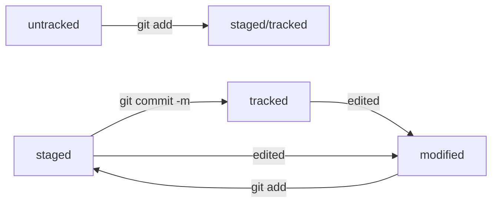

# Основные шаги для создания и работы с репозиторием

## создать директорию с проектом
mkdir practical-work-01  
cd practical-work-01

## инициализировать репозиторий
git init

## создать файл
touch README.md

## добавить файл в git
git add --all

## проверить, что git теперь наблюдает за этим файлом
git status

## внести контент в файл

## закоммитить сделанную на данный момент работу
git commit -m 'Добавлен README.md'

## создать remote репозиторий на GitHub
git@github.com:lodey/practical-work-01.git

## связать remote репозиторий с local
git remote add origin git@github.com:lodey/practical-work-01.git

## проверить связь
git remote -v

## сделать первый push
git push -u origin main

## финальный commit
git commit -m 'Завершен README.md'

## .. и финальный push
git push

## HASH
hash - это основной идентификатор коммита. Вычисляется по определенному алгоритму и состоит из символов шестнадцатиричной системы счисления.

## HEAD
HEAD - файл со ссылкой на последний актуальный коммит

## лог
git log дает полезную инфу обо всех коммитах.  
git log --oneline даёт ту же инфу в компактном виде, удобно и полезно.

## статусы файла в git

